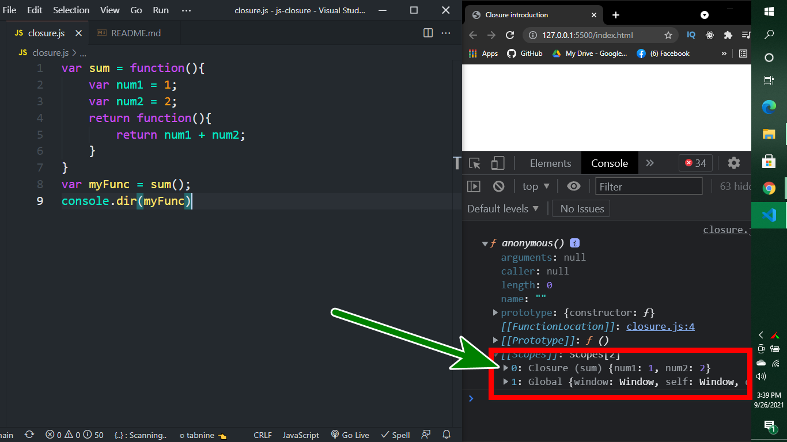

# In simple way explain Javascript Closure
```javascript
var num1 = 1;
var num2 = 2;

var sum = function(){
    return num1 + num2;
}
console.log(sum())
```
আমরা যদি উপরের কোড গুলো দেখি তাহলে দেখতে পাবো যে `num1` এবং `num2` function এর বাইরে আছে কিন্তু তার পর ও function এর ভিতর থেকে আমরা `num1 + num2` কে ব্যাবহার করতে পারছি। আর্থাৎ আমরা parent এর জিনিস গুলাকে child থেকে excess করতে পারি। 
*কিন্তু আসলে কিভাবে এইটা ঘটে?*
এইটা ঘটে `closure` এর মাধ্যমে।
closer parent এর যেসব জিনিস গুলা child excess চায় সেই জিনিস গুলার একটা রেফারেন্স নিজের ভিতরে রাখে এবং child এর মধ্যে সেই reference সহ একটা অব্জেক্ট তৈরি হয় এবং এই অব্জেক্টের নাম হয় `closure`. নিচের কোড গুলো লক্ষ করি।
```javascript
var sum = function(){
    var num1 = 1;
    var num2 = 2;
    return function(){
        return num1 + num2;
    }
}
var myFunc = sum();
console.dir(myFunc)
```
এই কোড গুলোর output নিচের ছবিতে দেওয়া হলো

